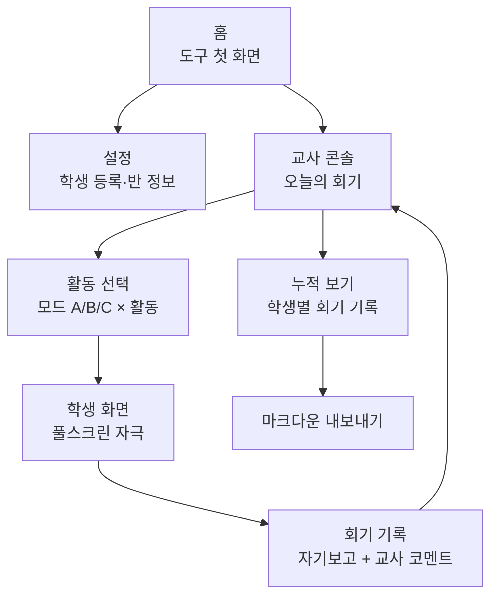
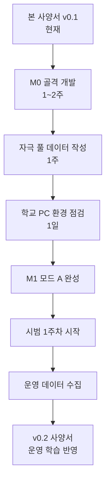

# 디지털네이티브 안구운동 도구 — 기능 사양 v0.1

> [!info] 이 문서의 자리매김
> 본 사양서는 [[2026-05-06 디지털네이티브 안구운동 문해력 프로그램 설계서 v0.1#5. Saccade·Fixation 웹 프레젠테이션 도구 — 개념 설계|설계서 §5]]의 개념 설계를 *구현 가능한 기능 사양*으로 옮긴다. 이 단계의 목표는 **개발 가능성**이 아니라 **개발 후 시범 운영에서 답할 질문이 분명한가**다. 따라서 본 사양은 *최소 기능*에 의도적으로 머문다.

## 0. 한 페이지 요약

| 항목 | 내용 |
|---|---|
| **도구 형태** | 정적 웹앱 (HTML + JS, 빌드 불필요) |
| **운영 환경** | 학교 PC / 태블릿 / 교실 큰 화면, Chrome·Edge 최신 버전 |
| **3가지 모드** | A. Saccade Trainer / B. Mode-Switch Trainer / C. Fixation Builder |
| **사용자** | 교사(콘솔), 학생(화면 자극 응답) |
| **기록** | 회기당 학생 1줄 자기보고 + 교사 1줄 코멘트, 로컬 저장 |
| **내보내기** | 옵시디언 마크다운 파일 (수동 다운로드) |
| **1차 출시 범위** | 모드 A의 4개 활동 + 교사 콘솔 + 마크다운 내보내기 |
| **명시적 비-목표** | 시선 추적, 점수화, 클라우드, 계정, 모바일 |

---

## 1. 도구의 목적과 범위

### 1.1 목적

본 도구는 학급 5분 루틴 또는 개별 지원 15분 회기에서 **교사가 단순 클릭 한 번으로 통제된 시각 자극을 화면에 띄우게 하는 것**이 일차 목적이다. 학생은 자극에 따라 안구를 움직이고, 회기 종료 후 *짧은 자기보고*만 입력한다.

### 1.2 핵심 가치 명제

| 누가 | 무엇을 | 어떻게 |
|---|---|---|
| 교사가 | 매일 5분 안구운동 루틴을 운영 가능하게 | 도구를 *준비 시간 없이* 즉시 띄울 수 있게 |
| 학생이 | 일관된 자극 패턴을 경험 | 매 회기 *동일한 강도·위치·타이밍*으로 |
| 가설 검증이 | 운영 데이터를 모으게 | *학생 자기보고 + 교사 관찰* 1줄씩 누적 |

### 1.3 1차 버전이 답해야 할 질문 (도구 설계의 잣대)

도구의 모든 결정은 다음 5개 질문에 *직접 도움이 되는가*로 판단한다:

1. 교사가 *3분 안에* 학급에서 띄울 수 있는가?
2. 학생이 *별도 학습 없이* 화면을 보고 따라할 수 있는가?
3. 회기 기록이 *클릭 2회 이내*로 저장되는가?
4. 8주간 누적 데이터를 *옵시디언으로* 한 번에 옮길 수 있는가?
5. 도구 자체가 *학생을 산만하게 하는 자극*이 되지 않는가?

---

## 2. 사용자와 운영 시나리오

### 2.1 두 사용자

| 사용자 | 역할 | 인터페이스 |
|---|---|---|
| **교사** | 회기 시작·종료, 강도 선택, 코멘트 입력 | 교사 콘솔 (`/teacher`) |
| **학생** | 화면 자극에 시선·키보드로 응답, 자기보고 입력 | 학생 화면 (`/run`, 풀스크린) |

학생은 *로그인하지 않는다*. 학생 식별은 교사가 콘솔에서 *사전 등록한 학생 목록 중 선택*하는 방식. 익명 운영도 지원(이름 없이 "학생 1·2·3" 등).

### 2.2 표준 시나리오 — 학급 5분 루틴

```
1. 교사가 교실 화면에 도구 페이지 띄움
2. "오늘의 활동" 카드 클릭 (사전 일정에 따른 추천)
3. "전체 학급" 모드로 시작 → 풀스크린 자극
4. 5분 자극 종료 → 학생들 종이책 짧은 읽기
5. 학생 대표 1명이 "오늘의 한 줄" 입력 (선택)
6. 교사가 1줄 관찰 코멘트 입력 → 저장
```

총 소요: 5분 + 입력 30초.

### 2.3 표준 시나리오 — 개별 지원 15분 회기

```
1. 교사가 학생 선택 (3명 중 1명)
2. 해당 학생의 Phase·진행에 맞춘 활동 선택
3. 학생이 직접 화면 앞에 앉음
4. 자극 → 응답 (학생 본인이 키보드 응답 가능한 경우)
5. 회기 종료 후 학생이 자기보고 1줄 입력
6. 교사가 관찰 코멘트 1줄 입력 → 저장
```

---

## 3. 정보 구조와 페이지 흐름



### 3.1 페이지 목록

| 페이지 | URL | 주요 요소 |
|---|---|---|
| 홈 | `/` | 큰 버튼 2개 — "오늘의 회기 시작" / "교사 콘솔" |
| 설정 | `/setup` | 학생 명단 등록·삭제, 학기 시작일, 기본 강도 단계 |
| 교사 콘솔 | `/teacher` | 학생 선택, 활동 선택, 강도 슬라이더, 시작 버튼 |
| 학생 화면 | `/run/:mode/:activity` | 풀스크린 자극, ESC로 즉시 종료 |
| 회기 기록 | `/report/:sessionId` | 자기보고 1줄 + 교사 코멘트 1줄 + 저장 |
| 누적 보기 | `/history/:studentId` | 한 학생의 회기 기록 시간순 |
| 내보내기 | `/export` | 옵시디언 마크다운 다운로드 |

---

## 4. 모드별 상세 사양

### 4.1 모드 A. Saccade Trainer

**대응 가설 축**: ① 수평 사카드 강화 ([[2026-05-06 디지털네이티브 안구운동 문해력 프로그램 설계서 v0.1#축 ① 수평 사카드 강화|설계서 §2.2 축 ①]])

#### 활동 A1. 두 점 점프 (Two-point saccade)

- 화면 좌우 두 점이 *교대로* 켜진다 (한 번에 한 점만)
- 학생은 켜진 점을 응시 → 다음 점이 켜지면 시선 이동
- **조절 변수**:

| 변수 | 단계 | 설명 |
|---|---|---|
| 점 간격 (degrees) | S/M/L | 화면 너비의 30% / 60% / 90% |
| 교대 주기 | 빠름/보통/느림 | 0.6s / 1.2s / 2.0s |
| 점 크기 | 작음/보통/큼 | 16px / 32px / 48px |
| 세션 길이 | 30s / 60s / 90s | 학급 5분에 1회 |

- **종료 조건**: 시간 만료 또는 ESC
- **기본 강도**: 모두 "보통" 단계

#### 활동 A2. 행 추적 (Line tracking)

- 화면 가운데 *한 줄의 단어*가 표시 (예: "고양이 강아지 토끼 새 물고기 거북이 사슴 곰")
- 단어 하나가 차례로 *왼쪽 → 오른쪽*으로 강조 (배경 색 변화)
- 학생은 강조되는 단어를 시선으로 따라간다
- **조절 변수**:

| 변수 | 단계 | 설명 |
|---|---|---|
| 단어 수 | 5 / 8 / 12 | 행 길이 |
| 강조 속도 | 느림/보통/빠름 | 1.0s / 0.7s / 0.5s 단어당 |
| 폰트 크기 | M/L/XL | 24px / 36px / 48px |
| 단어 간격 | 좁음/보통/넓음 | 한 글자 / 두 글자 / 세 글자 폭 |

- **단어 풀**: 교사가 사전 입력 가능 / 기본 풀(2학년 수준 명사 100개) 제공

#### 활동 A3. Return sweep drill

- 화면에 *2~4행*의 단어 행 표시
- 한 행 끝 단어 강조 → *다음 행 첫 단어*로 강조 점프
- 학생은 *행 끝 → 다음 행 시작*의 시선 이동을 반복 훈련
- **조절 변수**:

| 변수 | 단계 | 설명 |
|---|---|---|
| 행 수 | 2 / 3 / 4 | 점진 확장 |
| 행 간격 | 좁음/보통/넓음 | 1.5em / 2.0em / 3.0em |
| 들여쓰기 | 없음/있음 | 다음 행 시작점이 다를 때 더 어려움 |
| 점프 속도 | 느림/보통/빠름 | 점프 직전 0.3s / 0.6s / 1.0s 머묾 |

#### 활동 A4. 단어 등장 (RSVP 변형)

- 화면의 *정해진 위치 시퀀스*에 단어가 차례로 등장 (왼쪽 → 오른쪽 → 다음 행)
- RSVP(Rapid Serial Visual Presentation)와 달리 *위치 정보*도 함께 — 스크롤이 아니라 *읽기와 같은 위치에서* 단어가 나타남
- **조절 변수**:

| 변수 | 단계 | 설명 |
|---|---|---|
| 등장 속도 | 60 / 100 / 150 단어/분 | 학년에 따라 |
| 동시 표시 단어 수 | 1 / 3 / 5 | 1=완전 RSVP, 5=짧은 행 |
| 텍스트 길이 | 1문장 / 1단락 / 2단락 | 짧게 시작 |

- **텍스트 풀**: 교사가 직접 입력 / 기본 단락 풀(3학년 수준 짧은 글 20편)

### 4.2 모드 B. Mode-Switch Trainer

**대응 가설 축**: ② 수직↔수평 *전환* ([[2026-05-06 디지털네이티브 안구운동 문해력 프로그램 설계서 v0.1#축 ② 수직↔수평 *전환* 능력 훈련|설계서 §2.2 축 ②]])

#### 활동 B1. 상하 분할 전환

- 화면을 상하 절반으로 분할
  - **상단**: 수직 스크롤 자극 — 짧은 메시지 카드들이 위→아래로 흐름 (SNS 피드 형식)
  - **하단**: 수평 텍스트 행 — 책 형식의 한 단락
- *신호음·색 신호*에 따라 학생은 시선을 상↔하로 옮긴다
- **조절 변수**:

| 변수 | 단계 | 설명 |
|---|---|---|
| 전환 주기 | 5s / 8s / 12s | 한 영역 머무는 시간 |
| 전환 횟수 | 4 / 6 / 8 | 회기당 |
| 신호 형식 | 색만/소리만/색+소리 | 학생 환경에 따라 |

- **수직 자극의 의도된 단조로움**: SNS 모방 자극은 *내용을 흥미롭게 하지 않는다*. 색 카드 + 짧은 단어 (예: "파랑", "빨강", "노랑") 정도. 도구 자체가 학생을 끌어당기지 않도록.

#### 활동 B2. 모드 명명 카드

- 화면에 자극 화면 *예시 이미지* (스크롤 / 책 페이지 / 영화 자막 등)가 차례로 표시
- 학생은 키보드/터치로 "수직" 또는 "수평" 선택
- 메타인지 명명 자체가 활동
- **조절 변수**: 카드 표시 시간(2s / 4s / 6s)

#### 활동 B3. 같은 글 두 번 읽기

- 같은 짧은 글(3~5문장)을 *연이어* 두 번 표시:
  1. **수직 배치본** — 한 줄에 한 단어 / 위→아래 스크롤 형식
  2. **수평 배치본** — 일반 책 형식
- 두 번 다 읽고 나서 학생은 "어느 쪽이 더 잘 이해됐나요?" 1줄 자기보고
- 도구는 *어느 쪽이 정답*이라고 판단하지 않음 — 학생의 *경험 비교* 자체가 메타인지 자료

### 4.3 모드 C. Fixation Builder

**대응 가설 축**: ③ 깊은 읽기 attention 회복 ([[2026-05-06 디지털네이티브 안구운동 문해력 프로그램 설계서 v0.1#축 ③ 깊은 읽기 attention 회복 (Wolf 노선)|설계서 §2.2 축 ③]])

#### 활동 C1. 응시 카드

- 화면 중앙에 *한 단어*가 표시
- 학생은 단어를 *응시 시간 동안* 응시
- 시간 종료 후 단어 아래 입력란에 *떠오른 것 한 줄* 입력 (또는 종이 기록 옵션)
- **조절 변수**:

| 변수 | 단계 | 설명 |
|---|---|---|
| 응시 시간 | 3s / 5s / 8s | 학생 가용에 따라 |
| 단어 종류 | 명사 / 동사 / 추상어 | 점진 확장 |
| 단어 수 | 5 / 8 / 12 | 회기당 |

- **단어 풀**: 교사 입력 또는 기본 풀(국어 교과 어휘 200개)

#### 활동 C2. Slow read minute (도구 보조)

- 화면에 *짧은 단락* 표시 (60~80자)
- 진행 막대가 *60초 동안 천천히* 채워짐
- 학생은 *60초에 걸쳐* 단락을 읽는다 — 도구는 진행 막대로 페이스 안내
- 60초 후 *세 단어*만 적기 — 떠오른 단어, 인상 깊은 단어, 새로 알게 된 단어 (이 중 하나)
- **조절 변수**: 시간(45s / 60s / 90s), 단락 길이

---

## 5. 교사 콘솔

### 5.1 화면 구성 (와이어프레임)

```
┌─────────────────────────────────────────────────┐
│  [도구 이름]                  [설정] [내보내기] │
├─────────────────────────────────────────────────┤
│                                                 │
│  ▸ 학생 선택                                    │
│    [전체 학급 ▾]  [학생 A ▾]  [학생 B ▾] ...    │
│                                                 │
│  ▸ 오늘의 활동                                  │
│    추천: [Phase 1 - A1 두 점 점프]              │
│    또는 직접 선택:                              │
│    [모드 A ▾] → [활동 A1 ▾] → [강도: 보통 ▾]    │
│                                                 │
│  ▸ 시간 설정                                    │
│    [○ 30s] [● 60s] [○ 90s] [○ 5분 루틴]         │
│                                                 │
│  ▸ 화면                                         │
│    [● 풀스크린] [○ 윈도우]                      │
│                                                 │
│             [   회기 시작 ▶   ]                 │
│                                                 │
└─────────────────────────────────────────────────┘
```

### 5.2 권장 활동 자동 추천 (옵션)

- 시범 운영 일정에 따라 오늘의 *기본 활동*을 추천
- 추천 로직: 학사 일정 + 시범 8주 일정 ([[2026-05-06 디지털네이티브 안구운동 문해력 프로그램 설계서 v0.1#7. 운영 일정 (시범 8주)|설계서 §7]])
- 교사가 *항상 무시 가능* — 추천은 단순 단축키일 뿐

### 5.3 회기 기록 입력 (회기 종료 직후)

```
┌─────────────────────────────────────────────────┐
│  회기 종료 — 2026-05-13 09:05                   │
│  활동: A1 두 점 점프 (보통)                     │
│  대상: 학급 전체                                │
├─────────────────────────────────────────────────┤
│                                                 │
│  학생 자기보고 (선택)                           │
│  [_____________________________________]        │
│  ※ 대표 학생 1명이 입력하거나 비워둠            │
│                                                 │
│  교사 관찰 한 줄                                │
│  [_____________________________________]        │
│                                                 │
│  Phase: [1 ▾]  Track: [A 학급 ▾]                │
│                                                 │
│             [   저장   ]   [   건너뛰기   ]     │
│                                                 │
└─────────────────────────────────────────────────┘
```

---

## 6. 데이터 모델

### 6.1 핵심 객체

```typescript
// 학생
type Student = {
  id: string            // uuid
  name: string          // "학생 A" 또는 실명
  grade: number         // 학년
  registeredAt: ISO8601
  notes: string         // 사전 메모
}

// 회기
type Session = {
  id: string
  date: ISO8601
  mode: "A" | "B" | "C"
  activity: string      // "A1" | "A2" | ...
  intensity: "low" | "medium" | "high"
  duration: number      // seconds
  studentIds: string[]  // 빈 배열이면 학급 전체
  phase: 0 | 1 | 2 | 3 | 4
  track: "A" | "B"      // A 학급 / B 개별
  selfReport: string    // 한 줄
  teacherComment: string // 한 줄
  createdAt: ISO8601
}

// 학생-회기 연결 (개별 자료 누적용)
type StudentSession = {
  studentId: string
  sessionId: string
  observation: string   // 학생별 1줄 (선택)
}
```

### 6.2 저장 위치

| 자료 | 저장소 | 이유 |
|---|---|---|
| 학생 명단 | IndexedDB | 50~100명, 텍스트 위주 |
| 회기 기록 | IndexedDB | 8주 × 매일 ≈ 40 + 개별 트랙 ≈ 100 = 150회기 수준 |
| 자극 풀(단어·단락) | IndexedDB + 기본 JSON | 기본 풀은 정적, 교사 추가분만 IndexedDB |
| 설정 | localStorage | 강도 기본값, 학기 시작일 |

### 6.3 백업·복구

- *기본은 로컬* — 학교 PC 변경 시 데이터 분실 가능성 명시 경고
- "내보내기"로 모든 데이터를 *마크다운 + JSON*으로 다운로드 가능
- "가져오기"로 JSON 복구 가능 (8주 시범에서는 매주 1회 백업 권장)

---

## 7. 옵시디언 마크다운 내보내기 사양

### 7.1 두 가지 내보내기

| 내보내기 | 내용 | 용도 |
|---|---|---|
| **회기 일지 묶음** | 매 회기당 1개 마크다운 파일 | `30 Project/읽기를 위한 안구운동/raw/회기 일지/`에 직접 복사 |
| **학생 누적 기록** | 학생당 1개 마크다운 파일 | `30 Project/읽기를 위한 안구운동/raw/학생별/` |

### 7.2 회기 일지 파일 형식

파일명: `2026-05-13 회기 일지 - A1 두 점 점프.md`

```markdown
---
title: "2026-05-13 회기 일지 — A1 두 점 점프"
type: session-log
domains: [교육, 안구운동, 회기일지]
created: 2026-05-13
date: 2026-05-13
mode: A
activity: A1
intensity: medium
duration: 60
phase: 1
track: A
related:
  - "[[2026-05-06 디지털네이티브 안구운동 문해력 프로그램 설계서 v0.1]]"
---

# 2026-05-13 회기 일지 — A1 두 점 점프

## 회기 정보

- 일시: 2026-05-13 09:05
- 활동: A1 두 점 점프 (보통)
- 대상: 학급 전체
- Phase: 1
- Track: A 학급 루틴

## 학생 자기보고

> 점이 빨라질 때 눈이 좀 어지러웠어요.

## 교사 관찰

학급 전체 잘 따라옴. 학생 D, E는 시선이 점에 따라가지 못하고 화면 중앙에서 멈추는 경향. 다음 회기에 점 간격 좁혀서 도전.
```

### 7.3 학생 누적 기록 형식

파일명: `학생 A 누적 기록.md`

```markdown
---
title: "학생 A 누적 기록"
type: student-log
domains: [교육, 안구운동, 학생기록]
student: "학생 A"
phase: 1
track: B
related:
  - "[[2026-05-06 디지털네이티브 안구운동 문해력 프로그램 설계서 v0.1]]"
---

# 학생 A 누적 기록

## 회기 일지 (시간 역순)

### 2026-05-13 — A1 두 점 점프 (보통)
관찰: 행 끝에서 다음 행 시작점으로 점프할 때 0.5초 지연. 점 간격 M에서 안정.

### 2026-05-12 — A2 행 추적 (느림)
관찰: 4번째 단어부터 시선이 행에서 벗어남.

...
```

### 7.4 내보내기 동작

- 교사 콘솔 → "내보내기" → 기간 선택(이번 주/이번 달/전체)
- 도구가 마크다운 파일들을 *하나의 zip*으로 패키징
- 다운로드 후 교사가 옵시디언 폴더에 *수동으로 복사* (자동 동기화 X — 보안·단순성)

---

## 8. 자극 타이밍·정확성 요건

### 8.1 시간 정확성

자극의 위치·등장·소멸 타이밍은 다음 정확도 요건을 만족해야 한다:

| 요건 | 기준 |
|---|---|
| 자극 등장 지연 (목표 시간 대비) | ±16ms (60Hz 1프레임) |
| 자극 지속 시간 오차 | ±32ms |
| 두 자극 사이 간격 오차 | ±16ms |

### 8.2 구현 원칙

- `setTimeout`/`setInterval`은 *주 타이머로 사용 금지* — 정확도 부족
- `requestAnimationFrame` 기반 자체 타이밍 엔진 (`StimulusEngine`) 구현
- 시간 측정은 `performance.now()` 사용 (`Date.now()` 회피)
- 한 회기 동안 *프레임 드롭이 발생하면 회기 끝에 경고 표시*

### 8.3 화면 요건

- 60Hz 모니터 가정 (현장 학교 PC 표준). 120Hz 등에서는 부드럽기만 향상, 본 사양은 60Hz 기준.
- 풀스크린 모드(`Fullscreen API`) — 학생 화면에서 다른 UI 요소가 안구를 끌지 않도록.
- 어두운 환경 권장 — 흰 배경·검은 자극이 기본, 어두운 배경 옵션도 선택 가능.

---

## 9. 접근성·안전

### 9.1 시각 안전

- **광과민성 발작(photosensitive epilepsy) 회피**: 깜박임 주파수는 *3Hz 미만*으로 제한 (모드 A 두 점 점프의 빠름 단계도 1.7Hz). 깊이 변화·강한 색 대비 금지.
- **눈 피로 경고**: 1회기 90초 초과 시 다음 활동 권장 메시지. 5분 루틴 후 2분 휴식 권장 표시.

### 9.2 색약·시각 차이

- 색만으로 정보 전달 금지 — 색 + 위치 + 모양 중 *둘 이상*으로 신호
- 신호음과 색 신호는 항상 *동시 사용* (모드 B 활동)

### 9.3 폰트·텍스트

- 기본 폰트: 시스템 sans-serif (학교 PC 환경 표준)
- 행 추적·RSVP 활동에서 *학생 학년 수준* 폰트 크기 (3학년 36px 이상 권장)
- OpenDyslexic 옵션 (선택) — 난독 의심 학생용

### 9.4 즉시 종료

- ESC 키로 *언제든* 회기 즉시 종료
- 학생이 어지러움·피로를 호소하면 교사가 즉시 종료
- 회기 미완 종료도 기록 (자기보고는 비워두고 교사 코멘트만 입력)

---

## 10. 명시적 비-목표 (1차 버전이 *하지 않는* 것)

본 절은 1차 버전의 의도된 단순성을 사양 차원에서 못 박는다. 다음은 *기능 부재*가 아니라 *의도된 비-목표*다.

| 비-목표 | 이유 |
|---|---|
| 시선 추적(eye-tracking) | 하드웨어 의존 → 현장 운영 불가 |
| 사카드 속도·정확도 자동 측정 | 시선 추적 없이는 *간접 행동 지표*가 더 정직 |
| 학생 점수화·평가 | 본 도구는 훈련 환경, 평가 시스템 아님 |
| 학생 간 비교·랭킹 | 윤리적·교육적으로 부적절 |
| 클라우드 동기화 | 학교 PC 보안 정책·개인정보 부담 |
| 사용자 계정·로그인 | 학생 식별은 *교사 단말 내* 사전 등록만 |
| 모바일 우선 디자인 | 학생 스마트폰 사용을 *늘리는 도구가 됨* — 본 가설과 모순 |
| 게이미피케이션(점수·뱃지·연속 출석) | 도구가 학생을 *끌어당기는 자극*이 되면 안 됨 |
| AI 추천·개인화 알고리즘 | 단순 슬라이더로 충분, 블랙박스 회피 |
| 다국어 | 한국어만 (자극 단어·UI 모두) |

---

## 11. 기술 스택과 구현 노트

### 11.1 기술 선택

| 영역 | 선택 | 이유 |
|---|---|---|
| 언어 | TypeScript | 타입 안정성, 학습 곡선 수용 가능 |
| 빌드 | Vite (개발) → 정적 빌드 | 학교 PC에 *폴더 복사*만으로 실행 |
| UI 프레임워크 | Vanilla TS + Web Components 또는 Svelte | 의존성 최소 |
| 스타일 | Plain CSS (CSS Variables) | 빌드 단순성 |
| 라우팅 | 파일 기반 정적 라우팅 또는 hash router | 서버 없음 |
| 저장소 | IndexedDB (`idb` 라이브러리) | localStorage 한계(5MB) 초과 가능 |
| 압축·zip | `jszip` | 마크다운 묶음 다운로드 |
| 자극 엔진 | 자체 구현 (`requestAnimationFrame`) | 외부 라이브러리 회피 |

### 11.2 폴더 구조 (제안)

```
eye-movement-tool/
├── index.html
├── src/
│   ├── main.ts
│   ├── stimulus-engine.ts        # rAF 기반 타이밍 엔진
│   ├── storage.ts                # IndexedDB 래퍼
│   ├── export.ts                 # 마크다운·zip 내보내기
│   ├── pages/
│   │   ├── home.ts
│   │   ├── teacher-console.ts
│   │   ├── runner.ts             # 학생 자극 화면
│   │   └── history.ts
│   ├── modes/
│   │   ├── saccade/
│   │   │   ├── two-point.ts
│   │   │   ├── line-track.ts
│   │   │   ├── return-sweep.ts
│   │   │   └── word-flash.ts
│   │   ├── mode-switch/
│   │   │   ├── split.ts
│   │   │   ├── name-card.ts
│   │   │   └── two-readings.ts
│   │   └── fixation/
│   │       ├── card.ts
│   │       └── slow-read.ts
│   └── data/
│       ├── word-pool-2nd-grade.json
│       ├── word-pool-3rd-grade.json
│       └── paragraph-pool-3rd-grade.json
├── public/
│   └── (정적 자원)
└── dist/                          # 빌드 산출물
```

### 11.3 학교 PC 배포

- 빌드 산출물 `dist/`를 USB 또는 네트워크 드라이브로 학교 PC에 복사
- `index.html` 더블클릭으로 실행 (Chrome·Edge)
- *서버 없이 동작* — 모든 자원은 정적
- 단점: 일부 브라우저가 `file://` 스킴에서 IndexedDB 제약 → 학교 PC에 *간이 정적 서버*(`python -m http.server` 또는 PWA 설치) 가능성 검토

### 11.4 외부 의존성 최소 원칙

| 라이브러리 | 사용 여부 | 비고 |
|---|---|---|
| React/Vue/Angular | 사용 안 함 | 빌드 복잡성·번들 크기 |
| jQuery | 사용 안 함 | 모던 DOM API로 충분 |
| 차트 라이브러리 | 사용 안 함 | 1차 버전엔 차트 없음 |
| 아이콘 라이브러리 | 최소 (SVG 인라인) | 외부 아이콘 셋 회피 |

---

## 12. 개발 단계 (마일스톤)


| 마일스톤 | 범위 | 산출 시점 (시범 일정 기준) |
|---|---|---|
| M0 | 페이지 골격 + A1 두 점 점프만 | 시범 -2주 (2026-04 말 가능 시) |
| M1 | 모드 A 4개 활동 완성 | 시범 1주차 |
| M2 | 회기 기록·마크다운 내보내기 | 시범 2주차 |
| M3 | 모드 B·C 도입 | 시범 4주차 |
| M4 | 시범 종료까지 버그 수정·소소한 개선만 | 시범 8주차 종료 |

> [!tip] 개발 우선순위 원칙
> 새 기능보다 *현재 학급에서 즉시 작동하는 것*이 우선. M0가 어설퍼도 *띄울 수 있으면* 시범 시작 가능. 모드 B·C는 학급 루틴이 정착한 뒤 도입.

---

## 13. 테스트 시나리오

### 13.1 자극 타이밍 회귀 테스트

- 모드 A1 두 점 점프 60초 회기 동안 점 등장 간격을 로그
- 평균 오차 ±16ms 이내인지 자동 확인
- 다른 탭이 활성화된 상태에서도 정확한지 (백그라운드 스로틀링 회피)

### 13.2 데이터 영속성 테스트

- 회기 기록 후 브라우저 종료·재시작 시 데이터 유지 확인
- IndexedDB 100개 회기 누적 후 페이지 로드 시간 < 1초

### 13.3 마크다운 내보내기 검증

- 내보낸 마크다운을 옵시디언에서 열어 *frontmatter·wikilink가 인식*되는지 수동 확인
- 내보낸 zip 압축 해제 후 파일명에 한글 깨짐 없는지

### 13.4 풀스크린·ESC 동작

- 학생 화면이 *진정 풀스크린*인지 (브라우저 UI 노출 0)
- ESC 즉시 종료 — 자극 도중 누른 시점부터 *0.1초 이내*

### 13.5 현장 시나리오 시뮬레이션

- 교사가 처음 사용 시 *3분 안에* 첫 회기를 띄울 수 있는지 (사용성 1차 잣대)
- 학생 화면 띄우기 → 자극 종료 → 기록 → 저장의 *총 클릭 수* 측정 (목표: 7회 이내)

---

## 14. 검토 사항·한계

### 14.1 기록의 신뢰도 한계

학생 자기보고와 교사 1줄 코멘트는 *짧고 주관적*이다. 자극의 객관적 효과를 보여주는 자료가 아니라 *교사가 매일 같은 학생을 같은 자극에서 어떻게 다르게 보는가*의 *세로 단면*이다. 본 도구는 이 한계를 인정하고 *측정 도구*가 아닌 *관찰 도구*로 자리매김한다.

### 14.2 학생-도구 인터랙션의 도구 의존성

학생이 키보드·터치로 응답하는 활동(B2 모드 명명, C1 응시 카드)은 *도구 사용 자체가 또 다른 화면 상호작용*이라는 모순을 안는다. 1차 버전은 응답을 *최소화*(자기보고 1줄, 키 입력 없는 활동 우선)하여 모순을 줄이지만, 완전 해소는 불가능 — 본 한계를 *원리적*으로 받아들인다.

### 14.3 학교 PC 환경의 다양성

브라우저 버전·모니터 주사율·해상도가 학교마다 다르다. 본 사양의 ±16ms 정확성 요건은 *60Hz 가정* 위에서만 성립. 시범 운영 전 *해당 학교 PC에서의 자극 정확성 점검*을 거쳐야 한다.

### 14.4 자극 풀의 한계

기본 단어·단락 풀은 *외부 검증 없이* 작성될 가능성이 높다. 풀의 어휘 수준·내용 적합성은 *본 사양의 다음 버전에서 정밀화*해야 할 항목이며, 1차에는 *교사가 풀을 직접 입력 가능*하게 하여 우회한다.

### 14.5 *프로그램 가설*과 *도구 효과*의 분리 불가능성

도구가 효과를 보여도 그것이 *가설의 메커니즘이 옳다*는 증거가 되는지, *어떤 도구든 매일 5분 안구운동 활동을 하면 효과가 있다*는 증거가 되는지 분리할 수 없다. 시범 8주의 결과 해석에 이 한계가 *영구적으로 따라붙는다*.

---

## 15. 다음 단계



가까운 다음 작업 후보:

1. 자극 풀(2학년·3학년 단어·단락) 작성 — 별도 노트
2. 학생 등록·동의서 양식 (학부모 안내문)
3. 학교 PC 1대에서의 자극 정확성 점검 절차서
4. M0 코드 골격(레포지토리·CI·빌드) 결정

---

## 16. 본 사양과 설계서의 관계 — 닫는 메모

본 사양서는 [[2026-05-06 디지털네이티브 안구운동 문해력 프로그램 설계서 v0.1|설계서 v0.1]]의 §5 *웹 도구 개념 설계*를 *구현 가능한 기능 사양*으로 옮긴다. 두 문서는 다음 관계를 가진다:

| 설계서 v0.1 | 사양서 v0.1 (본 문서) |
|---|---|
| *왜* 이 도구가 필요한가 | *무엇을* 만들 것인가 |
| 가설·이론·운영 원리 | 페이지·데이터·자극 타이밍 요건 |
| 8주 운영 일정 | M0~M4 개발 마일스톤 |
| 평가·관찰 | 테스트 시나리오 |

본 사양은 *도구가 가설 검증의 일부*임을 상기한다. 1차 버전의 의도된 단순성은 *기능 부족*이 아니라 *가설과의 정합성*에서 나오는 결정이며, *완성도가 아니라 시범 가능성*이라는 잣대 하나로 모든 비-목표가 정당화된다.
