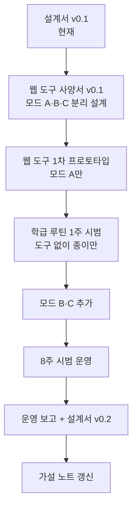

# 디지털네이티브 안구운동 문해력 프로그램 — 설계서 v0.1

> [!info] 이 문서의 자리매김
> 본 설계서는 [[2026-04-29 디지털네이티브 안구운동 문해력 가설 + raw 수집 계획|선행 가설 노트]]에서 정식화한 가설을 *교실에서 운영 가능한 형태*로 옮긴다. 가설 단계인 만큼, 본 프로그램은 *처치(treatment)*가 아니라 *구조화된 시범 운영(structured trial)* 으로 설계된다 — 즉, 운영 자체가 가설을 다듬는 관찰 장치를 겸한다.

## 0. 한 페이지 요약

| 항목 | 내용 |
|---|---|
| **대상** | (a) 학급 전체 — 아침 5분 루틴 / (b) 읽기 부진·집중 곤란 학생 2–4명 — 개별 지원 트랙 |
| **운영 기간** | 시범 8주 (2026-05-11 ~ 2026-07-03 가용 시) |
| **핵심 메커니즘** | ① 수평 사카드 강화 ② 수직↔수평 안구운동 *전환* ③ 깊은 읽기 attention 회복 |
| **운영 형태** | 학급 일상 루틴(5분) + 개별 지원(주 3회·15분) + 웹 프레젠테이션 도구 |
| **핵심 산출물** | 본 설계서 / Saccade·Fixation 웹 도구 / 사전·사후 관찰 기록 |
| **운영 가설** | 디지털 네이티브 아동의 수직 스크롤 안구 습관은 책 읽기의 좌→우 사카드 형성을 *간섭*하며, 이는 *명시적·구조화된 안구운동 훈련*과 *훈련 직후 종이책 짧은 읽기*를 결합할 때 가장 효율적으로 교정된다. |

---

## 1. 배경과 필요성

### 1.1 문제 진술

학급 관찰에서 반복되는 읽기 어려움의 양상은 단순한 *해독* 문제로 환원되지 않는다. 글자는 읽지만 *행을 놓치는*, 페이지의 *중앙·하단을 건너뛰는*, 한 단락을 끝까지 따라가지 못하고 *시선이 부유하는* 패턴이 자주 관찰된다. 이는 [[2026-04-29 디지털네이티브 안구운동 문해력 가설 + raw 수집 계획|선행 가설]]에서 제기한 *디지털 네이티브 아동의 안구운동 습관*과 정합적이다.

### 1.2 가설의 재정식화 (운영 가능한 형태)

> 디지털 네이티브 아동에게 책 읽기는 *해독 과제*이기 이전에 *안구 운동 모드 전환 과제*다. 스마트폰의 수직 스크롤 안구운동이 1차 모드로 자리잡은 상태에서, 책 읽기는 (1) 수평 사카드의 정확도, (2) 응시(fixation) 안정성, (3) 모드 전환의 유연성을 모두 요구한다. 따라서 *읽기 지도* 이전에 *안구운동의 인프라*를 다지는 단계가 필요하다.

이 형태는 두 가지 개입 지점을 함의한다:

1. **운동 차원** — 좌→우 사카드와 응시 자체를 분리해 훈련 (도구 의존)
2. **연결 차원** — 훈련 직후 *종이책 짧은 읽기*로 즉시 전이 (Wolf 노선의 attention 회복과 결합)

### 1.3 위치

본 설계는 다음 자리에 들어선다:

- 기초학력 지도와 인접하지만, **해독 부진(decoding deficit)** 모델과는 별개의 가설을 시험한다
- [[2026-04-29 디지털네이티브 안구운동 문해력 가설 + raw 수집 계획#2.1 인접 연구 (부분 뒷받침) — 안구운동 패턴 충돌|성인 대상 안구운동 충돌 연구]]를 *디지털 네이티브 아동*에 외삽하는 검증 시도이며, 검증되든 반증되든 빈자리를 메운다

---

## 2. 이론적 근거

### 2.1 안구운동의 두 기본 단위

읽기는 두 가지 안구운동의 정밀한 교대로 구성된다:

> [!abstract] Saccade (사카드, 도약)
> 한 응시점에서 다음 응시점으로 옮겨가는 *빠른 도약* (20–40ms). 읽기에서는 평균 7–9자 폭의 좌→우 도약과, 행 끝에서 다음 행 시작점으로 가는 *되돌림 사카드(return sweep)*가 핵심.

> [!abstract] Fixation (응시)
> 두 사카드 사이에 시선이 머무는 시간 (200–250ms). 이때만 시각 정보가 처리된다. 응시가 짧거나 불안정하면 단어를 *지나쳤지만 처리는 못한* 상태가 된다.

읽기 부진 학생에게서 자주 관찰되는 양상은 다음과 같이 분해된다:

| 관찰 양상 | 안구운동 차원의 해석 |
|---|---|
| 행을 놓침 | return sweep 부정확 |
| 글자를 빨리 훑는데 이해는 안 됨 | fixation 시간 부족 |
| 단어를 거꾸로 읽거나 건너뜀 | 회귀 사카드(regression) 과잉 |
| 페이지의 *위/아래로 시선이 튐* | 수직 사카드가 기본 모드로 침입 |

마지막 항목이 본 가설의 핵심 단서다.

### 2.2 핵심 메커니즘 3축

본 프로그램은 다음 세 축을 *분리해 훈련하고 통합해 적용*한다.

#### 축 ① 수평 사카드 강화

**원리**: 좌→우 사카드의 정확도와 속도를 직접 훈련. 자극을 *수평 축*에서만 점진적으로 길게 배치하여 수직 침입을 차단.

**주요 활동**:

- 두 점 사카드 (Two-point saccade) — 화면 좌·우 양 끝의 두 점을 번갈아 응시
- 행 추적 (Line tracking) — 한 행을 끝까지 *시선만으로* 따라가기
- 행 끝 → 다음 행 시작 점프 (Return sweep drill) — 책 읽기의 가장 어려운 운동

#### 축 ② 수직↔수평 *전환* 능력 훈련

**원리**: 충돌(conflict) 모델에서 *전환(switching)* 모델로 한 발 옮긴다. 두 모드를 *대립*시키지 않고 *명시적으로 구분·전환*하는 메타 능력을 길러, 수직 모드를 *억제*하는 대신 *상황에 따라 호출*하게 한다.

**주요 활동**:

- "지금은 수직 모드 / 지금은 수평 모드" — 메타인지 명명
- 수직 자극(스크롤형) → 신호음 → 수평 자극(텍스트 행)으로 전환
- 같은 콘텐츠를 *수직 배치본*과 *수평 배치본*으로 비교 읽기

#### 축 ③ 깊은 읽기 attention 회복 (Wolf 노선)

**원리**: 안구운동만 교정해도 *짧은 응시·skim 습관*이 남으면 깊은 읽기로 이어지지 않는다. 응시를 의도적으로 *길게* 잡아두고, 한 문장 안에서의 의미 구성을 명시적으로 다룬다.

**주요 활동**:

- 의도적 느린 읽기 (Slow read minute) — 한 단락을 1분에 걸쳐
- 응시 카드 (Fixation card) — 한 단어에 시선을 *3초* 머물게 하고 떠오르는 것 적기
- 문장 다시 말하기 — 안구운동 직후 *말로 옮기기*로 처리 깊이 검증

### 2.3 세 축의 통합 원리

세 축은 *독립적으로 훈련하되 매 회기마다 통합*한다. 회기당 표준 흐름:

```
[① 수평 사카드 워밍업 90초]
        ↓
[② 모드 전환 활동 60초]
        ↓
[③ 짧은 종이책 읽기 + 응시 의식화 90초]
        ↓
[기록 30초]
```

총 5분. 학급 아침 루틴으로 운영 가능한 분량.

---

## 3. 프로그램 구조

### 3.1 두 트랙

본 프로그램은 같은 메커니즘을 *서로 다른 강도*로 운영하는 두 트랙으로 구성된다.

| 트랙 | 대상 | 주기·시간 | 주된 도구 | 주된 목적 |
|---|---|---|---|---|
| **A. 학급 루틴 트랙** | 학급 전체 | 매일 5분 (아침활동) | 웹 도구 + 종이책 | 안구운동 인프라의 *학급 표준* 형성 |
| **B. 개별 지원 트랙** | 읽기 부진 학생 2–4명 | 주 3회 × 15분 | 웹 도구 + 개별 자료 + 1:1 관찰 | 진단 → 집중 훈련 → 일반화 |

두 트랙은 *같은 활동의 강도 차이*다. 이는 (i) 교사 부담을 낮추고, (ii) 개별 지원 학생이 *별난 처치를 받는다는 낙인*을 피하게 한다.

### 3.2 단계 (개별 지원 트랙 기준)


학급 루틴 트랙은 Phase 1–3을 *동시 병행*한다 (단계 분리하지 않음).

### 3.3 회기 구성 (5분 / 15분)

#### 5분 회기 (학급 루틴)

| 시간 | 활동 | 도구 |
|---|---|---|
| 0:00–1:30 | 수평 사카드 워밍업 | 웹 도구 |
| 1:30–2:30 | 모드 전환 활동 | 웹 도구 |
| 2:30–4:00 | 종이책 *짧은 읽기*(한 단락) + 응시 의식화 | 종이책 |
| 4:00–5:00 | 한 문장 다시 말하기 + 표시 | 종이책·기록표 |

#### 15분 회기 (개별 지원)

| 시간 | 활동 |
|---|---|
| 0:00–2:00 | 워밍업·체크인 (지난 회기 회상) |
| 2:00–7:00 | 축별 집중 훈련 (해당 Phase에 따라) |
| 7:00–11:00 | 종이책 통합 — 짧은 단락 *세 번* 읽기, 매 회 *다른 응시 과제* |
| 11:00–14:00 | 한 문장 다시 말하기 + 자기 평가 |
| 14:00–15:00 | 다음 회기 예고·기록 |

---

## 4. 활동 모듈 (축별)

### 4.1 축 ① 수평 사카드 모듈

| 활동 | 진행 | 강도 조절 |
|---|---|---|
| 두 점 점프 | 화면 좌·우 두 점을 번갈아 본다 (10초 × 3세트) | 점 간격 좁→넓, 속도 느림→빠름 |
| 행 추적 | 한 줄의 단어 행을 시선으로 따라간다 | 행 길이, 단어 간격 |
| Return sweep 점프 | 행 끝 → 다음 행 시작점만 반복 | 행 간격, 행 정렬(들여쓰기) 변화 |
| 단어 등장 | 화면의 정해진 위치에 단어가 차례로 나타난다 (RSVP 변형) | 등장 속도, 단어 간격 |

### 4.2 축 ② 수직↔수평 전환 모듈

| 활동 | 진행 | 핵심 |
|---|---|---|
| 모드 명명 카드 | "수직 모드" / "수평 모드" 카드를 보고 어떤 매체에서 쓰는지 말하기 | 메타인지 |
| 전환 신호 게임 | 수직 자극(스크롤) ↔ 수평 자극(읽기) 사이를 신호음 따라 전환 | 전환 비용의 의식화 |
| 같은 글 두 번 읽기 | 같은 짧은 글을 *수직 배치본*(스크롤 형식)과 *수평 배치본*(책 형식)으로 읽고 차이 보고 | 비교 |
| 멈춰 응시 | 수직 자극이 흐를 때 *한 단어*에 시선을 멈추는 연습 | 응시 안정성 |

### 4.3 축 ③ 깊은 읽기 attention 회복 모듈

| 활동 | 진행 | 도구 |
|---|---|---|
| Slow read minute | 1분에 한 단락 — 평소보다 *느리게* 읽고 끝나면 *세 단어*만 적기 | 종이책 |
| 응시 카드 | 한 단어에 *3초* 머물고, 그 단어가 떠올리게 하는 것을 한 줄로 적기 | 종이책 + 카드 |
| 한 문장 다시 말하기 | 읽은 것 중 한 문장을 *덮고* 다시 말하기 | 음성 / 학생-학생 페어 |
| 단락 그림 | 한 단락을 읽고 *작은 도식*으로 옮기기 | 빈 칸 학습지 |

> [!tip] 모듈 간 우선순위
> 시간이 부족하면 ① + ③의 *짧은 결합*을 우선. 즉, *수평 사카드 워밍업 + 짧은 종이책 읽기*. ②는 학생들이 ①에 충분히 익숙해진 뒤 도입한다 (도입 시점은 학급 루틴 기준 3주차).

---

## 5. Saccade·Fixation 웹 프레젠테이션 도구 — 개념 설계

> [!note] 이 절은 *개발 사양*이다
> 본 절은 코드 단계 이전의 *기능 사양·인터랙션 설계*에 해당한다. 별도 문서 [[디지털네이티브 안구운동 도구 — 기능 사양 v0.1]] (작성 예정)으로 분리할 후보. 여기서는 설계서의 일관성을 위해 핵심만 적는다.

### 5.1 도구의 역할 — 무엇을 하고 무엇을 하지 *않는가*

이 도구는 다음을 한다:

- 화면에 *통제된 시각 자극*을 정확한 시간·위치로 제시
- 활동 단계와 강도를 교사가 *선택* 가능
- 학생의 진행을 *주관적·간단한* 형태로 기록 (자기 보고 + 교사 1줄 코멘트)

이 도구는 다음을 *하지 않는다*:

- 시선 추적(eye-tracking) 하드웨어 의존 — 교실 현장 운영 가능성 우선
- 정량 지표 자동 산출(사카드 속도 등) — 본 단계에서는 *행동 관찰*이 더 중요
- 학생 평가·점수화 — 도구는 *훈련 환경*이지 *평가 시스템*이 아님

### 5.2 화면 구성 (3개 모드)

#### 모드 A. Saccade Trainer

```
┌─────────────────────────────────────────┐
│                                         │
│   ●                                ●    │  ← 두 점 점프
│                                         │
└─────────────────────────────────────────┘

┌─────────────────────────────────────────┐
│  단어 단어 단어 단어 단어 단어 단어 단어  │  ← 행 추적
└─────────────────────────────────────────┘

┌─────────────────────────────────────────┐
│  ───────────────────────────────────→   │
│  ↓                                       │  ← Return sweep
│  ←───────────────────────────────────   │
└─────────────────────────────────────────┘
```

- 자극 위치: 좌우 끝 / 행 / 행 끝–다음 행 시작
- 조절 변수: 점 간 간격, 자극 등장 속도, 행 길이, 행 간격
- 시각 단순성: 흰 배경·검은 자극·장식 최소화 (스마트폰 UI와 *반대 방향*)

#### 모드 B. Mode-Switch Trainer

- 화면을 상하로 분할 — 위 절반: 수직 스크롤 자극 / 아래 절반: 수평 텍스트 행
- 신호음·색 신호로 학생이 *시선을 옮길 곳*을 지시
- 종료 후 "어떤 모드가 더 어려웠나요?" 1줄 자기보고

#### 모드 C. Fixation Builder

- 한 단어가 화면 중앙에 표시됨 (3·5·8초 등 선택)
- 단어 아래 빈 칸에 *떠오른 것 한 줄*을 키보드 또는 종이로 기록
- 깊은 읽기 attention을 *기능적으로* 재훈련

### 5.3 교사 콘솔 (최소)

| 기능 | 설명 |
|---|---|
| 활동 선택 | 모드 A·B·C와 강도 단계 |
| 회기 시작·정지 | 단순 토글 |
| 회기 기록 | 학생 1줄 자기보고 + 교사 1줄 관찰 코멘트 |
| 누적 보기 | 한 학생의 회기 기록 시간순 펼쳐 보기 |
| 내보내기 | 옵시디언으로 [[관찰 일지]] 형태 마크다운 추출 |

### 5.4 기술 스택 후보 (검토 단계)

- **프런트만 있는 정적 웹앱**(HTML+JS)으로 시작 — 서버 없이 학교 PC·태블릿에서 즉시 실행
- 자극 타이밍은 `requestAnimationFrame` 기반 (`setTimeout` 회피)
- 기록은 로컬 저장 (IndexedDB) + 옵시디언 마크다운 파일 내보내기
- 추후 옵션: 시선 추적 가능 환경(WebGazer.js 등)과 결합 가능성만 *후보*로 둠 (1차 설계엔 미포함)

> [!warning] 1차 도구의 의도된 단순성
> 1차 버전은 *완성도가 아니라 시범 운영 가능성*이 목표다. 교사가 학급에서 *오늘 당장* 5분간 띄울 수 있는 정적 웹페이지 한 장에서 출발하고, 시범 8주 동안 학생 반응을 보며 점진적으로 확장한다.

---

## 6. 진단·관찰·평가

### 6.1 사전·사후 측정 도구

> [!warning] 정량 지표의 한계
> 시선 추적 장비 없이 *사카드 속도·정확도*를 정량 측정하는 것은 학교 현장에서 비현실적. 본 프로그램은 *간접 행동 지표*에 의존하며, 시범 운영의 결과는 *효과의 통계적 입증*이 아니라 *가설의 운영 가능성·학생 반응 패턴*에 대한 자료다.

| 영역 | 도구 | 측정 시점 |
|---|---|---|
| 행 추적 정확도 | 행 추적 검사지(20행, 6.2 참조) — 놓친 행 수 | 사전·중간·사후 |
| 분당 읽기 속도 (CWPM) | 교사 검사지 | 사전·중간·사후 |
| 1단락 회상 정확도 | 1문장 다시 말하기 채점 | 사전·중간·사후 |
| 자기보고 — 책 읽기 어려움 | 5문항 리커트 | 사전·사후 |
| 학부모 보고 — 가정 내 읽기 시간 | 1주 일지 | 사전·사후 |
| 회기별 관찰 | 교사 1줄 코멘트 | 매 회기 |

### 6.2 행 추적 검사지 (간이)

20행 짧은 글에서 *행을 놓치는 횟수*를 학생이 손가락 없이 읽을 때 관찰. 사전·사후 비교.

### 6.3 가설 시험 가능성

본 시범은 다음 *관찰 가능한 패턴*으로 가설을 직간접 검증한다:

- 수평 사카드 훈련 직후 *짧은 읽기 정확도가 즉각 상승*하는가? → 축 ① 효과
- 수직↔수평 모드 전환 어휘를 *학생이 자발적으로 사용*하는가? → 축 ② 효과
- 응시 의식화 활동 후 1문장 회상이 개선되는가? → 축 ③ 효과
- 가정 스마트폰 사용 시간이 많은 학생일수록 사전 행 추적 곤란이 큰가? → 가설의 핵심 상관

### 6.4 기록 흐름 — 옵시디언 통합

회기 기록은 다음 위치에 누적:

```
30 Project/읽기를 위한 안구운동/raw/
├── 사전 측정/
├── 회기 일지/
│   └── YYYY-MM-DD 회기 일지.md
├── 학생별/
│   └── 학생 A 누적 기록.md
└── 사후 측정/
```

각 회기 일지는 frontmatter에 `phase`, `track`(A/B), `date`, `students` 속성을 둔다. 추후 base 파일로 모아 보기 가능.

---

## 7. 운영 일정 (시범 8주)

| 주 | Phase | 학급 루틴 트랙 | 개별 지원 트랙 | 도구 |
|---|---|---|---|---|
| 1 | 0 진단 | 도입 안내 + 첫 사카드 활동 | 사전 측정·기준선 수집 | 측정지 |
| 2 | 1 수평 사카드 | ①에 집중한 5분 루틴 | 두 점 점프·행 추적 집중 | 모드 A |
| 3 | 1 수평 사카드 | (동일) | Return sweep 도입 | 모드 A |
| 4 | 2 모드 전환 | ② 도입 — 모드 명명 카드 | 모드 명명·전환 신호 | 모드 A+B |
| 5 | 2 모드 전환 | ②와 ① 결합 | 같은 글 두 번 읽기 | 모드 A+B |
| 6 | 3 깊은 읽기 통합 | Slow read minute 도입 | 응시 카드·문장 회상 | 모드 A+B+C |
| 7 | 3 깊은 읽기 통합 | (동일) | 단락 그림·자기 평가 | 전체 |
| 8 | 4 일반화·평가 | 학생 자체 운영 시도 | 사후 측정·1:1 인터뷰 | 측정지 |

> [!tip] 한 사이클이 끝난 뒤
> 8주 시범 후 *결과 정리 노트* 작성 → 가설 노트로 *피드백 루프* 닫기. 부분 검증/반증/수정 모두 *자료 가치 있음*.

---

## 8. 가정 연계 (최소 부담 버전)

학부모 안내문 1장 + 1주 일지로 시작. 핵심 메시지 3개만 전달:

1. 가정의 종이책 *짧은* 읽기(5분) 권유 — *길게*가 아니라 *자주*
2. 잠자리 1시간 전 스마트폰 *수직 스크롤* 자제
3. 자녀가 학급에서 배우고 온 *모드 전환 어휘*를 가정에서 함께 써 주기

> [!warning] 의도적으로 좁은 메시지
> 디지털 미디어 사용 일반에 대한 가치 판단은 의도적으로 피한다. 본 프로그램은 *훈련 가능한 안구운동 인프라*에 초점을 맞추며, 가정 통신은 *프로그램과 정합적인 환경 설계*만을 다룬다.

---

## 9. 검토 사항 — 본 설계가 짚어 두는 한계

### 9.1 인과 식별의 한계

8주 시범은 *통제집단·무선배정* 없이 운영되며, 따라서 효과가 관찰되어도 *훈련의 효과*인지 *시간·발달의 효과*인지 분리하기 어렵다. 본 시범은 *가설의 다듬기와 운영 가능성 검증*을 일차 목표로 한다.

### 9.2 도구 1차 버전의 협소함

웹 도구의 1차 버전은 *시선 추적이 없으며* 자극 위치·타이밍 통제만 한다. 따라서 학생의 안구운동을 *직접* 측정하지 않는다 — 측정은 행 추적 검사지·읽기 속도 같은 *간접 행동 지표*에 의존한다.

### 9.3 가설의 부분성

수직 스크롤 안구운동이 *유일한* 또는 *주요한* 읽기 방해 요인이라는 강한 주장은 본 설계가 의도하지 않는다. 안구운동 인프라는 읽기의 *필요조건의 일부*이며, 음운 인식·어휘·배경지식 등 다른 차원과 *상호작용*한다 (참고: [[음운 인식과 조사 — 명시적 지도 자료]]).

### 9.4 학급 운영의 현실 제약

매일 5분의 학급 루틴이 학기 중 일관되게 유지되리라는 가정은 강한 가정이다. 학교 행사·결강·학생 결석으로 *불완전 운영*이 일반적이며, 본 프로그램은 *완전 운영을 전제로 하는 효과 검증*이 아니라 *불완전 운영에서도 학생 반응 패턴이 어떻게 형성되는가*를 본다.

### 9.5 윤리적 고려

읽기 부진 학생을 *별도 트랙*으로 분리하는 데서 오는 낙인 가능성은 두 트랙을 *같은 활동의 강도 차이*로 설계함으로써 최소화한다. 또한 사전·사후 자기보고는 *비교·평가*가 아니라 *학생 자신의 변화 인식*을 위한 자료로만 사용한다.

---

## 10. 다음 단계 — 본 설계서 이후의 작업 흐름



가까운 다음 작업 후보:

1. [[디지털네이티브 안구운동 도구 — 기능 사양 v0.1]] 분리 작성 (5절을 별도 문서로 확장)
2. 학부모 안내문 1장 초안
3. 행 추적 검사지·읽기 속도 검사지 시안
4. 8주 시범 일정의 학사 일정 정합 점검 (현장학습·시험 일정 회피)

---

## 11. 본 설계와 가설의 관계 — 닫는 메모

본 설계서는 [[2026-04-29 디지털네이티브 안구운동 문해력 가설 + raw 수집 계획|선행 가설 노트]]를 *닫지 않는다*. 오히려 가설 노트의 §6 *검토 사항*에서 짚었던 빈자리(특히 A11·A12 결정적 빈자리)를 *교실에서 운영해 보면서 동시에 정밀화*하는 장치로 본다. 따라서 시범 운영 중 관찰되는 모든 패턴은 *가설을 다듬을 자료*이지 *가설의 입증·반증 종결*이 아니다.

본 프로그램의 진짜 산출물은 *교실에서 작동하는 운동 모듈*과 *교사가 가설을 정밀하게 만드는 데 쓰는 자료*, 두 가지다. 이 둘은 분리되지 않는다 — 어떤 활동이 학생에게 작동했는가를 묻는 것이 곧 가설의 어느 측면이 옳았는가를 묻는 것이다.

---

## 출처·참조

- [[2026-04-29 디지털네이티브 안구운동 문해력 가설 + raw 수집 계획]] — 본 설계서의 모든 이론 자원의 출처
- 본 설계서 v0.1은 *가설 노트*에 정리된 A1~A12, B1~B5 자료 중 직접 내용에 반영된 것은 일부이며, 시범 운영 보고(v0.2 예정) 단계에서 본격 통합 예정
